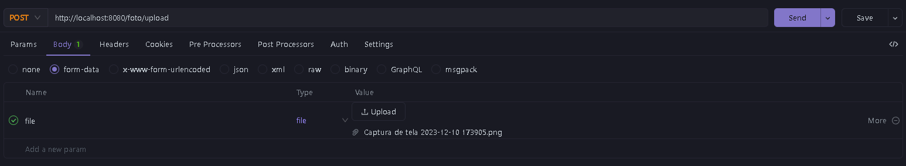

## Resumo do Backend de Upload de Fotos com Spring Boot

Este aplicativo backend Spring Boot facilita o upload de fotos por meio de pontos de extremidade RESTful. Aqui está um resumo dos principais componentes:

### Classe FotoController

#### Pontos de Extremidade:
- **/foto/uploadForm (GET):**
  - Retorna a página HTML para o upload de fotos.

- **/foto/upload (POST):**
  - Trata o upload de um único arquivo.
  - Espera um parâmetro de arquivo multipart chamado "file" na solicitação.
  - Utiliza a classe `UploadUtils` para realizar a operação de upload.
  - Retorna ResponseEntity apropriado com base no sucesso ou falha do upload.

- **/foto/outraRotaDeUpload (POST):**
  - Outro exemplo de ponto de extremidade demonstrando o upload de arquivo usando uma operação diferente em `UploadUtils`.
  - Estrutura semelhante ao ponto de extremidade /foto/upload.

### Classe UploadUtils

#### Métodos:

- **fazerUploadImagem(MultipartFile imagem):**
  - Método estático para fazer o upload de uma imagem.
  - Aceita um MultipartFile como parâmetro.
  - Verifica se o arquivo não está vazio.
  - Cria um diretório para armazenar o arquivo se não existir.
  - Constrói o caminho do arquivo no servidor e escreve o arquivo enviado.
  - Imprime mensagens de sucesso ou falha.
  - Retorna um booleano indicando o sucesso do upload.

### Observações:
- Os arquivos enviados são armazenados em um diretório especificado dentro do espaço de trabalho do projeto.
- A manipulação de erros está implementada para casos em que o arquivo está vazio ou ocorre uma exceção durante o processo de upload.
- Mensagens de sucesso ou falha são impressas no console.

### Uso:
1. Acesse o ponto de extremidade /foto/uploadForm para obter o formulário HTML para o upload de fotos.
2. Envie uma foto usando o ponto de extremidade /foto/upload com o parâmetro "file".
3. O backend utiliza a classe `UploadUtils` para lidar com as operações de upload de arquivos.
4. As ResponseEntity indicam o sucesso ou falha da operação de upload.

Este backend fornece uma estrutura simples e modular para lidar com o upload de fotos em uma aplicação Spring Boot. Ajustes podem ser feitos conforme necessário para requisitos específicos do projeto.

### 